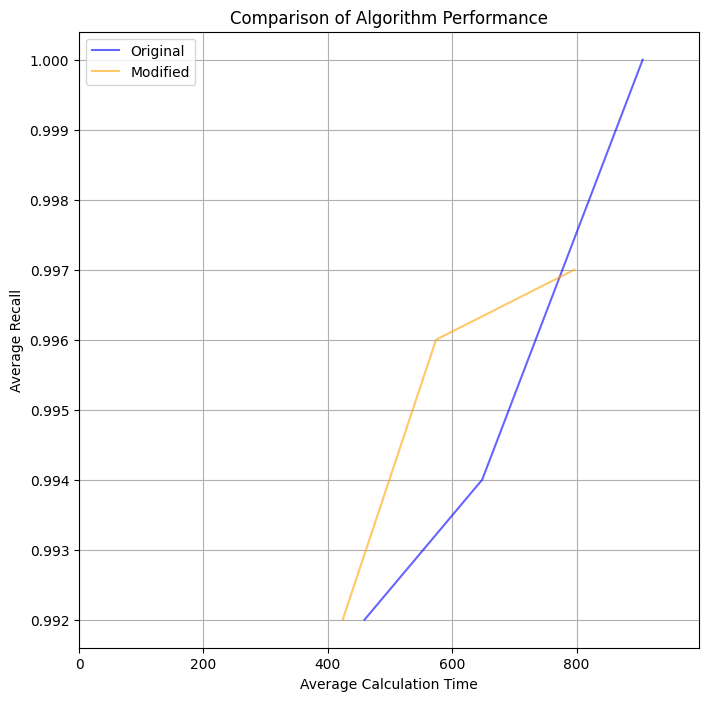

# Results

## SIFT-10K

The experimental results are depicted at the following Figure.

| Methods    | M0 | M  | Ef | Recall | Avg calc|
| --------   | -- |--- |--- |--------|---------|
| Baseline   | 16 | 8  | 64 | 0.992  | 459.01  |
| Modified   | 16 | 8  | 64 | 0.992  | 423.88  |
| Baseline   | 32 | 16 | 64 | 0.994  | 648.19  |
| Modified   | 32 | 16 | 64 | 0.996  | 574.0   |
| Baseline   | 64 | 32 | 64 | 1.0    | 906.21  |
| Modified   | 64 | 32 | 64 | 0.997  | 796.46  |

## SIFT-1M

The experimental results are depicted at the following Figure.

| Methods    | M0 | M  | Ef | Recall | Avg calc|
| --------   | -- |--- |--- |--------|---------|
| Baseline   | 16 | 8  | 64 |   |   |
| Modified   | 16 | 8  | 64 |   |   |
| Baseline   | 32 | 16 | 64 |   |   |
| Modified   | 32 | 16 | 64 |   |   |
| Baseline   | 64 | 32 | 64 |   |   |
| Modified   | 64 | 32 | 64 |   |   |

## Hardware
Experiments were conducted on the Apple ARM M1 chip